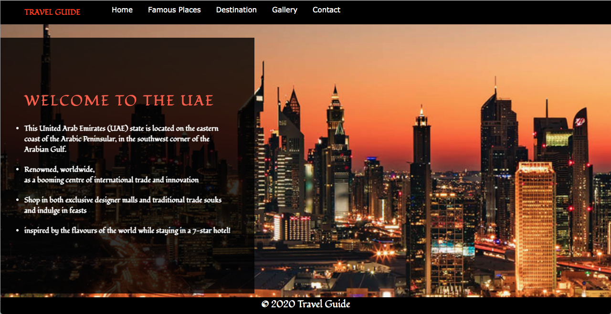
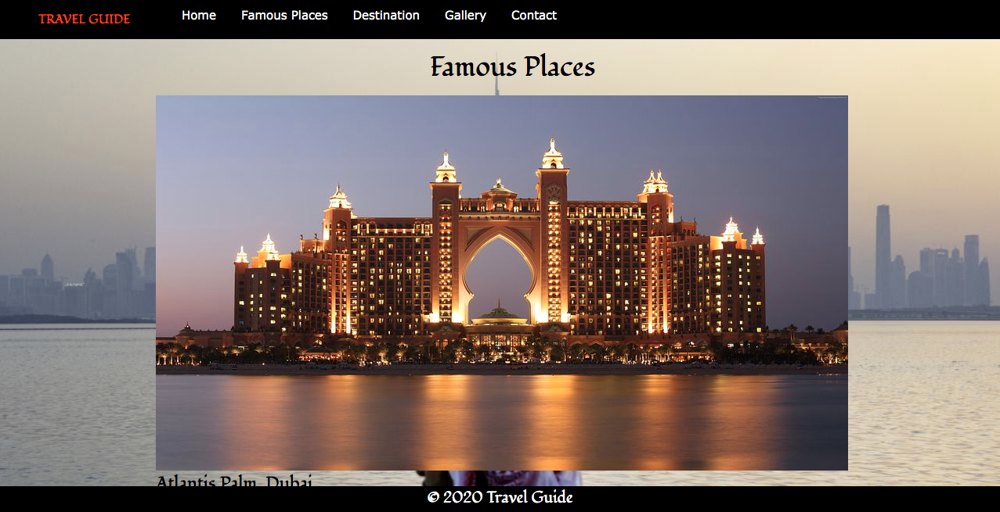
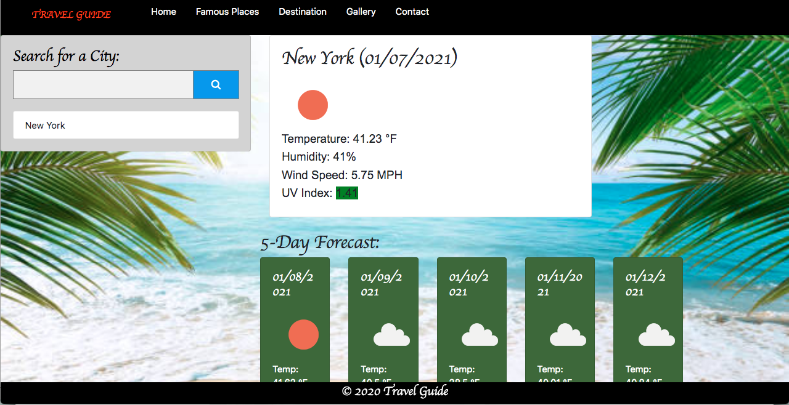
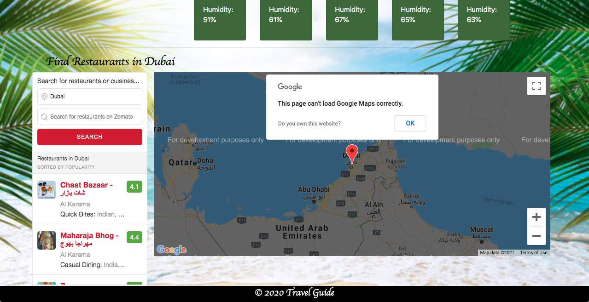
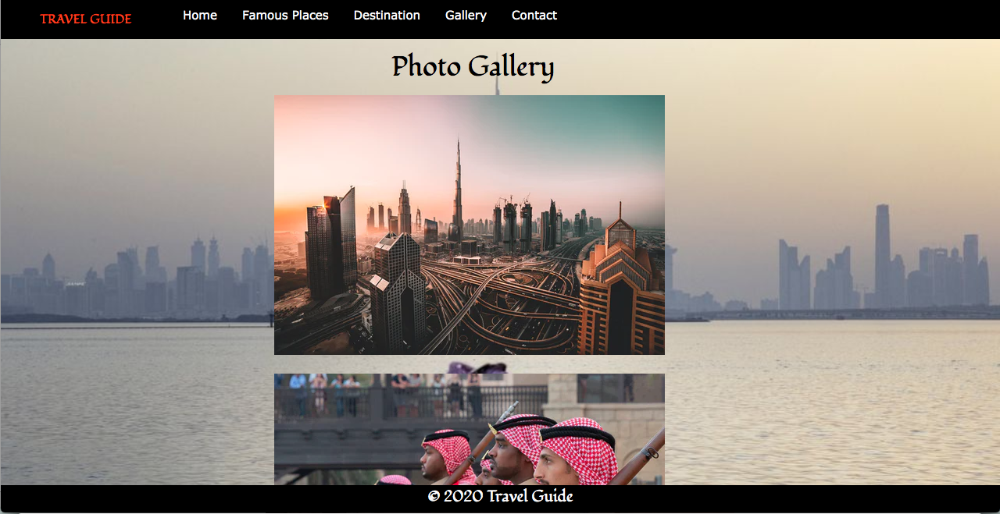
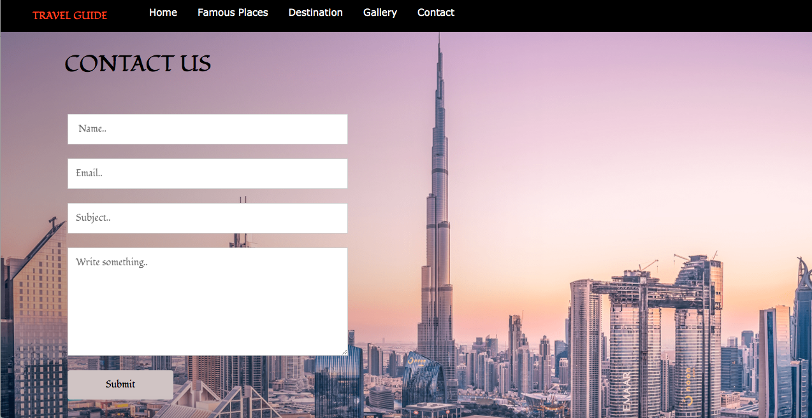

# Travel Guide
This Application can be used in any browser available. The purpose of this application is to provide tourists help in guidance finding deliciouse foods, location of restourants,current weather and 5 days  weather foreacst.

### HOW TO USE THE APPLICATION
- Clone this repository.
- Open in any browser available.
- To contact for help click on the navigation button that says contact.
- To look for famouse place click on the famouse place navigation button.
- To look for gallry of different places in dubai click on the gallery navigation button.
- To check the current weather of the city and 5 day forecast weather just enter the city name you are looking for and hit search button.

### Technologies Used
- HTML
- CSS
- MOMENT JS
- JAVASCRIPT
- J QUERY
- API

## LINK TO THE REPOSITORY

- The link is [Travel Guide](https://github.com/NataliaSozontova/group_project)

## LINK TO THE WEBSITE
- The link is [Travel Guide](https://nataliasozontova.github.io/group_project/)

## SCREENSHOTS

